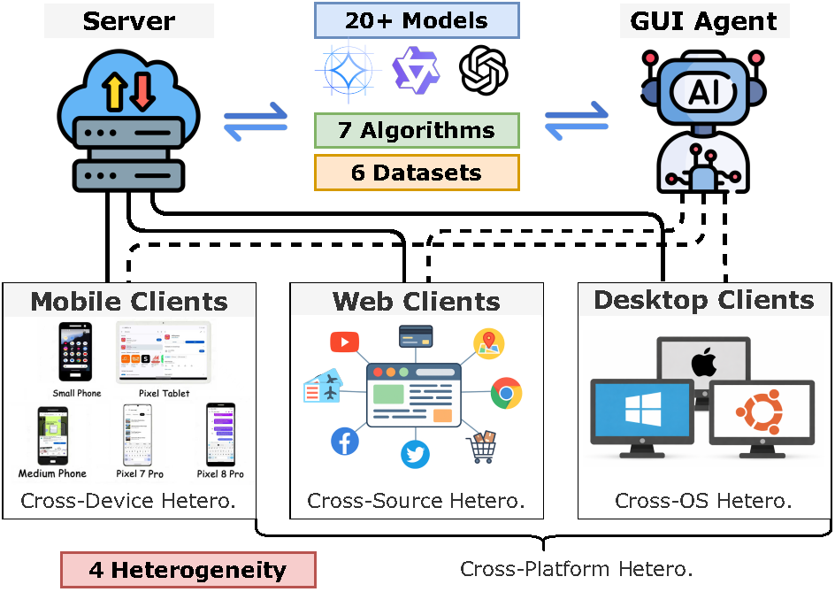

# 🌐 **FedGUI: Benchmarking Federated GUI Agents across Heterogeneous Platforms, Devices, Sources, and Operating Systems**

**FedGUI** is the first comprehensive benchmark designed for developing and evaluating federated GUI agents across diverse platforms, including **Mobile, Desktop, and Web**. It addresses the privacy and scalability challenges of traditional centralized training by leveraging Federated Learning (FL) to train generalized agents on heterogeneous, decentralized data.

<p align="center">
  
</p>

---

## 📋 **Features**

* **Platform Diversity**
  Supports over **900 mobile apps**, **40+ desktop applications**, and **200+ websites**.

* **Comprehensive Heterogeneity**
  Systematically models four types of real-world heterogeneity:
  **Cross-Platform, Cross-Device, Cross-OS, and Cross-Source**.

* **Unified Action Space**
  Standardizes interactions across all platforms into **17 discrete action types**, including basic actions (e.g., CLICK, TYPE) and platform-specific custom actions.

* **Extensive Model & Algorithm Support**
  Integrates **7 FL algorithms** (e.g., FedAvg, FedYogi, FedAdam) and supports **20+ base VLMs** such as Qwen3-VL, InternVL2, and Gemma-3.

---

## 🏗️ **Project Structure**

```text
FedGUI/
├── swift/                        
│   ├── llm/                      
│   │   ├── sft.py                 
│   │   ├── utils/             
│   │   └── test_fedgui.py         
│   ├── cli/                      
│   ├── trainers/           
│   ├── tuners/                   
│   └── ui/                      
├── data_process/                   
│   ├── action_normalize.py        
│   ├── gen_message_VLM.py          
│   └── single_dataset_level/      
│       ├── 0_dump_AC.py
│       ├── 0_dump_AitW.py
│       ├── 1_gen_jsonl.py
│       └── ...
├── scripts/                        
│   ├── train/
│   │   └── run_fedavg.sh          
│   └── evaluation/
│       ├── eval_fed.sh          
│       └── test.py                 
├── requirements/                  
│   ├── framework.txt            
│   ├── eval.txt                   
│   └── ...
├── setup.py                        
└── requirements.txt              
```

---

## 🚀 **Quick Start**

### 1️⃣ Installation

Ensure you have **Python ≥ 3.8** and **CUDA** installed.
FedGUI is built upon the **ms-swift** framework.

```bash
git clone https://anonymous.4open.science/r/FedGUI-1B15/
cd FedGUI
pip install -e .[all]
```

---

### 2️⃣ Data Preparation

FedGUI utilizes **9 curated datasets** derived from **6 major sources**:

* **Mobile**
  AndroidControl (AC), AitW, GUI Odyssey (GO)

* **Web**
  Mind2Web (M2W), GUIAct-Web (GA-W), OmniAct-Web

* **Desktop**
  AgentSynth (AS), OmniAct-Mac/Windows

The `data_process/single_dataset_level/` directory contains scripts for processing each dataset individually. These scripts handle **data extraction, normalization, and conversion** to the unified format required by FedGUI.

```bash
cd data_process/single_dataset_level
python 0_dump_AC.py
python 1_gen_jsonl.py --data_dir ./data/processed_android_control
```

---

### 3️⃣ Multi-Dataset Aggregation and VLM Message Generation

After processing individual datasets, use `gen_message_VLM.py` to **aggregate multiple datasets** and convert episode-level data into **step-level format** with **VLM-compatible prompts**.

**Usage Example:**

```bash
cd data_process
python gen_message_VLM.py
```

**Configuration:**

Edit the configuration section in `gen_message_VLM.py`:

```python
DISTRIBUTION_MODE = "iid"

NUM_CLIENTS = 9
OUTPUT_FILE = "./output/converted_data.jsonl"

DATASET_CONFIGS = [
    {
        "path": "./datasets/GUI_Odyssey/train_600.jsonl",
        "sample_count": 600,
        "name": "GUI_Odyssey",
    },
    {
        "path": "./datasets/GUIAct_Web/train_600.jsonl",
        "sample_count": 600,
        "name": "GUIAct_Web",
    },
    {
        "path": "./datasets/Mind2Web/train_600.jsonl",
        "sample_count": 600,
        "name": "Mind2Web",
    }
]
```

Each step contains:

```json
{
    "images": "/path/to/screenshot.png",
    "query": "Task instruction with history...",
    "response": "Actions:\nCLICK <point>[[100, 200]]</point>",
    "client_id": 0
}
```

---

## 📖 **Training and Evaluation**

### 🔁 Training with Federated Learning

FedGUI supports **7** representative Federated Learning (FL) algorithms (e.g., FedAvg, FedYogi, FedAdam) and is compatible with **20+** base vision-language models (VLMs), including Qwen3-VL, InternVL2, and Gemma-3, enabling flexible and parameter-efficient adaptation across heterogeneous clients.To reduce communication and computation overhead, FedGUI adopts LoRA (Low-Rank Adaptation), where only lightweight adapter parameters are exchanged between the server and clients, making large-scale VLM training feasible even on a single RTX 4090.
GPU.

A typical training command is shown below:
```bash
bash scripts/train/run_fedavg.sh <GPU_ID> 10 3 qwen2-vl-7b /path/to/model FedGUI-Full
```

---


### 📊 Evaluation

FedGUI evaluates GUI agent performance using **three action-level metrics**:

1. **Action Type Accuracy (Type)**
   Measures whether the predicted interaction intent matches the ground-truth action type, based on the **first token** of the generated action.

2. **Grounding Accuracy (Ground)**
   Evaluates spatial correctness for coordinate-based actions (e.g., `CLICK`, `DOUBLE_CLICK`).
   A prediction is considered correct if the **Euclidean distance** between predicted and ground-truth coordinates is within **14% of the screen diagonal**, ensuring robustness across different screen sizes.

3. **Success Rate (SR)**
   Reflects end-to-end execution accuracy, requiring both correct action type and parameters.
   For text-based actions, semantic correctness is measured using a **Similarity Score** (token-level F1 + character-level overlap), with a success threshold of **0.5**.

```bash
bash scripts/evaluation/eval_fed.sh <GPU_ID> <DATASET_NAME> <MODEL_TYPE> <CHECKPOINT_PATH> <ROUND_NUM>
```

